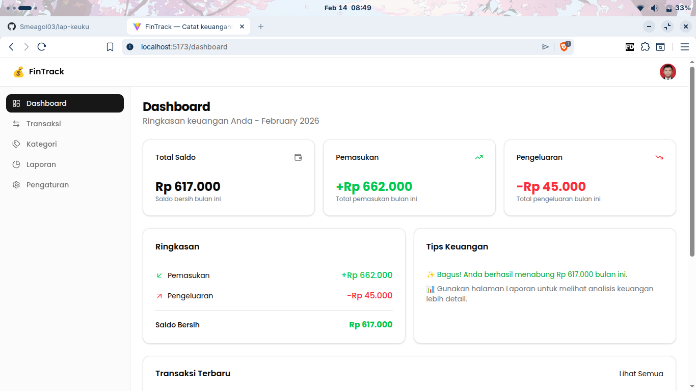
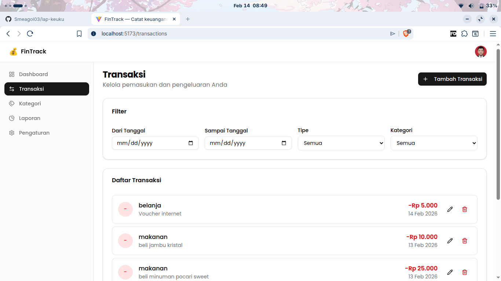
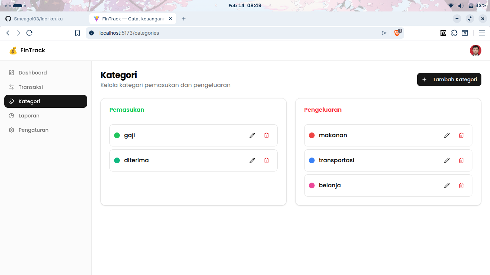
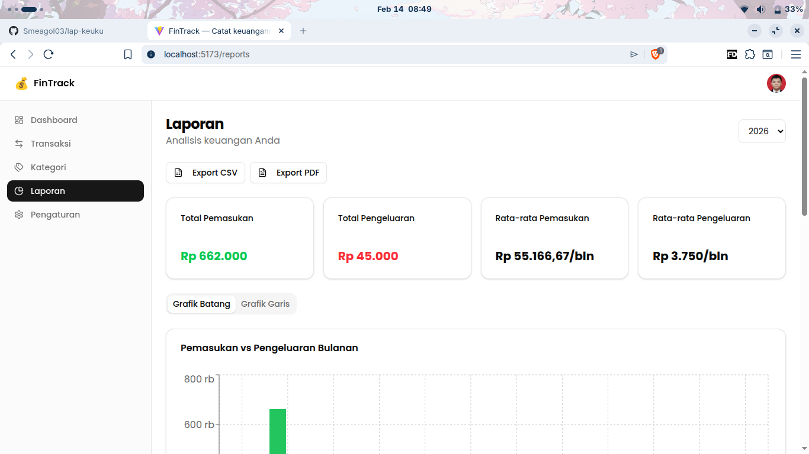
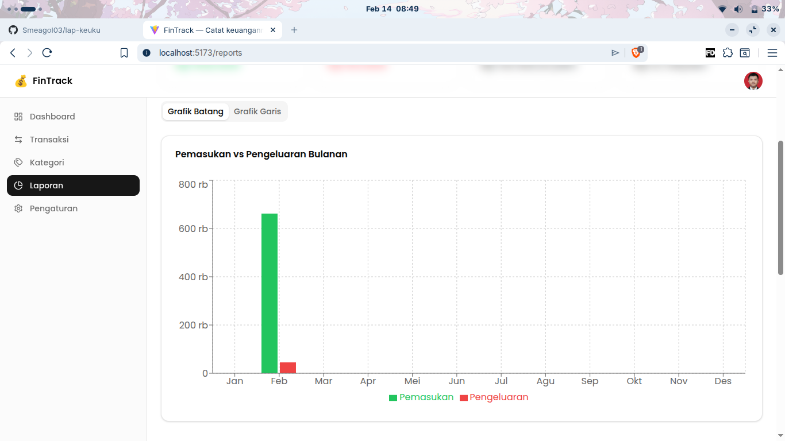
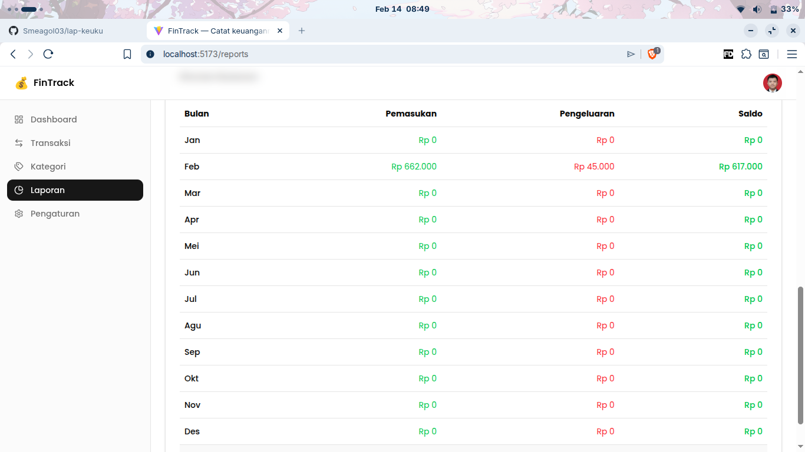

<div align="center">
  
  <h1>FinTrack</h1>
  <p><strong>Catat keuanganmu dengan mudah dan cepat.</strong></p>
  <p>Fokus pada tujuan finansialmu, biarkan FinTrack yang urus pencatatannya.</p>
  <br />
  
  
  
  
  
</div>

## 📋 Daftar Isi
- [✨ Tentang FinTrack](#-tentang-fintrack)
- [📸 Tangkapan Layar](#-tangkapan-layar)
- [🚀 Fitur Unggulan](#-fitur-unggulan)
- [🛠️ Teknologi yang Digunakan](#️-teknologi-yang-digunakan)
- [🏗️ Arsitektur Aplikasi](#️-arsitektur-aplikasi)
- [🔐 Keamanan](#-keamanan)
- [🏁 Panduan Memulai](#-panduan-memulai)
- [⚙️ Konfigurasi](#️-konfigurasi)
- [🧪 Testing](#-testing)
- [📦 Deployment](#-deployment)
- [🤝 Kontribusi](#-kontribusi)
- [📄 Lisensi](#-lisensi)

## ✨ Tentang FinTrack

FinTrack adalah aplikasi web modern yang dirancang untuk membantumu mengelola keuangan pribadi dengan cara yang paling sederhana. Lupakan kerumitan spreadsheet atau aplikasi yang membingungkan. Dengan antarmuka yang bersih dan intuitif, FinTrack membuat pencatatan transaksi harian, pemantauan pengeluaran, dan visualisasi arus kas menjadi aktivitas yang menyenangkan.

Aplikasi ini dibangun dengan pendekatan **mobile-first** dan **responsive design**, sehingga kamu bisa mengaksesnya dari berbagai perangkat. FinTrack memberikan pengalaman pengguna yang cepat dan aman berkat integrasi dengan Supabase sebagai backend service.

## 📸 Tangkapan Layar

<div align="center">
  
  
</div>

<div align="center">
  
  
</div>

<div align="center">
  
  
</div>

## 🚀 Fitur Unggulan

- **📊 Dashboard Interaktif:** Dapatkan ringkasan kondisi finansialmu dalam sekejap.
- **💸 Pencatatan Transaksi Cepat:** Tambah pemasukan dan pengeluaran dalam hitungan detik.
- **🗂️ Kategori Fleksibel:** Kelompokkan transaksimu dengan kategori yang bisa disesuaikan.
- **📈 Laporan Visual:** Pahami kebiasaan belanjamu melalui grafik dan laporan yang mudah dibaca.
- **🔐 Keamanan Terjamin:** Otentikasi aman dan data disimpan dengan Supabase.
- **📱 Desain Responsif:** Akses dan catat keuanganmu dari perangkat apa pun, desktop maupun mobile.
- **🔄 Sinkronisasi Real-time:** Data kamu selalu terbaru di semua perangkat.
- **📤 Ekspor Data:** Simpan laporan dalam format CSV atau PDF.

## 🛠️ Teknologi yang Digunakan

| Kategori | Teknologi |
|----------|-----------|
| **Frontend** | [React](https://react.dev/), [Vite](https://vitejs.dev/), [TypeScript](https://www.typescriptlang.org/) |
| **Backend & Database** | [Supabase](https://supabase.com/) |
| **Styling** | [Tailwind CSS](https://tailwindcss.com/) |
| **UI Components** | [shadcn/ui](https://ui.shadcn.com/) |
| **Manajemen State** | [Zustand](https://github.com/pmndrs/zustand) & [TanStack Query](https://tanstack.com/query) |
| **Routing** | [React Router](https://reactrouter.com/) |
| **Form** | [React Hook Form](https://react-hook-form.com/) & [Zod](https://zod.dev/) |
| **Visualisasi Data** | [Recharts](https://recharts.org/) |

## 🏗️ Arsitektur Aplikasi

FinTrack mengikuti arsitektur **frontend-backend terpisah** dengan:

- **Frontend**: React SPA (Single Page Application) dengan TypeScript
- **Backend**: Supabase (PostgreSQL + Auth + Storage)
- **State Management**: Zustand untuk state lokal, TanStack Query untuk cache data
- **UI Framework**: Tailwind CSS dengan komponen shadcn/ui
- **Authentication**: Supabase Auth dengan login Google

Struktur direktori utama:
```
src/
├── components/     # Komponen UI dan fitur
├── hooks/         # Custom hooks
├── lib/           # Fungsi utilitas dan konfigurasi
├── pages/         # Halaman aplikasi
├── services/      # Layanan API
├── stores/        # Store Zustand
├── types/         # Definisi tipe TypeScript
└── assets/        # Gambar dan aset statis
```

## 🔐 Keamanan

FinTrack dirancang dengan keamanan sebagai prioritas utama:

- **Authentication**: Login Google melalui Supabase Auth
- **Authorization**: Setiap pengguna hanya bisa mengakses data miliknya sendiri
- **Input Validation**: Validasi di sisi klien dan server menggunakan Zod
- **SQL Injection Prevention**: Supabase client secara otomatis melakukan parameter binding
- **Session Management**: Penanganan session yang aman oleh Supabase
- **Environment Variables**: Credential tidak disimpan dalam kode

## 🏁 Panduan Memulai

Ikuti langkah-langkah berikut untuk menjalankan FinTrack di lingkungan lokalmu.

### Prasyarat

- [Node.js](https://nodejs.org/) (v18 atau lebih baru)
- [npm](https://www.npmjs.com/) atau [pnpm](https://pnpm.io/)
- Akun gratis di [Supabase](https://supabase.com/)

### 1. Clone Repositori

```bash
git clone https://github.com/alpiant/FinTrack.git
cd FinTrack
```

### 2. Instal Dependensi

```bash
npm install
```

### 3. Konfigurasi Lingkungan Supabase

- Buat proyek baru di [dashboard Supabase](https://app.supabase.com/).
- Pergi ke **Settings -> API**.
- Buat file baru bernama `.env.local` di root proyek Anda.
- Tambahkan variabel berikut:

```env
VITE_SUPABASE_URL="URL_PROYEK_SUPABASE_ANDA"
VITE_SUPABASE_PUBLISHABLE_DEFAULT_KEY="KUNCI_ANON_PUBLISHABLE_ANDA"
```

- Ganti nilai di atas dengan URL Proyek dan kunci `anon`, `public` dari pengaturan API Supabase Anda.

### 4. Jalankan Aplikasi

```bash
npm run dev
```

Aplikasi sekarang akan berjalan di `http://localhost:5173` (atau port lain yang tersedia).

## ⚙️ Konfigurasi

### Environment Variables

| Variabel | Deskripsi |
|----------|-----------|
| `VITE_SUPABASE_URL` | URL proyek Supabase kamu |
| `VITE_SUPABASE_PUBLISHABLE_DEFAULT_KEY` | Kunci anon publishable dari Supabase |

### Skrip Package

| Skrip | Deskripsi |
|-------|-----------|
| `npm run dev` | Menjalankan aplikasi dalam mode development |
| `npm run build` | Membuat build produksi |
| `npm run build:prerender` | Membuat build produksi dengan prerender |
| `npm run lint` | Menjalankan ESLint untuk mengecek kode |
| `npm run preview` | Melihat pratinjau build produksi secara lokal |

## 🧪 Testing

Untuk saat ini, FinTrack belum memiliki suite testing yang komprehensif. Namun, kami berencana untuk menambahkan:

- Unit tests menggunakan Jest dan React Testing Library
- Integration tests untuk alur bisnis utama
- E2E tests menggunakan Cypress atau Playwright

## 📦 Deployment

FinTrack siap untuk deployment ke berbagai platform hosting modern:

### Vercel (Direkomendasikan)
1. Hubungkan repositori ke Vercel
2. Tambahkan environment variables di pengaturan Vercel
3. Deploy otomatis akan berjalan

### Netlify
1. Hubungkan repositori ke Netlify
2. Atur build command ke `npm run build`
3. Atur publish directory ke `dist/`

### Platform lain
Pastikan untuk mengatur environment variables dan routing SPA (Single Page Application) dengan benar.

## 🤝 Kontribusi

Kami menyambut kontribusi dari komunitas! Untuk berkontribusi:

1. Fork repositori ini
2. Buat branch fitur kamu (`git checkout -b fitur/AwesomeFeature`)
3. Commit perubahan kamu (`git commit -m 'Tambahkan fitur AwesomeFeature'`)
4. Push ke branch (`git push origin fitur/AwesomeFeature`)
5. Buka Pull Request

Silakan baca [CONTRIBUTING.md](CONTRIBUTING.md) untuk detail panduan kontribusi (akan dibuat segera).

### Pedoman Kontribusi

- Pastikan kode kamu mengikuti standar TypeScript dan ESLint
- Tambahkan dokumentasi untuk fitur baru
- Pastikan perubahan kamu tidak merusak fungsionalitas yang sudah ada
- Ikuti prinsip clean code dan SOLID

## 📄 Lisensi

Proyek ini dilisensikan di bawah [Lisensi MIT](LICENSE) - lihat file [LICENSE](LICENSE) untuk detail lengkap.

## 📞 Dukungan

Jika kamu menemukan masalah atau memiliki pertanyaan:

- 🐛 Laporkan bug di [Issues](https://github.com/alpiant/FinTrack/issues)
- 💬 Diskusikan ide di [Discussions](https://github.com/alpiant/FinTrack/discussions)
- 📧 Hubungi pengembang melalui [Email](mailto:alpiant@example.com)

---

<div align="center">
  <p>Dibuat dengan ❤️ oleh Alpiant</p>
  <p><em>"Fokus pada tujuan finansialmu, biarkan FinTrack yang urus pencatatannya."</em></p>
</div>